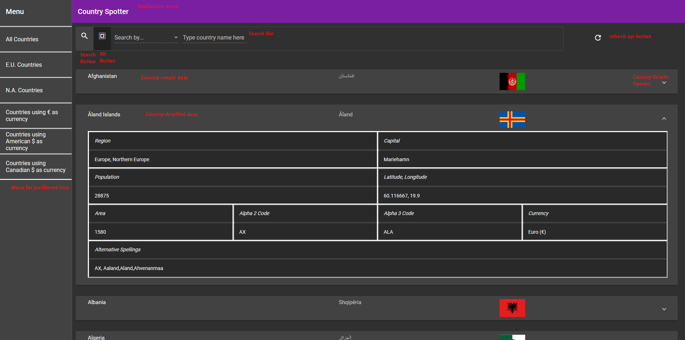

# Country

Country, a GUI based on ANGULAR 6 allowing to search informations about countries.

## Getting Started

These instructions will get you a copy of the project up and running on your local machine for development and testing purposes.

# Country Spotter

Country Spotter is a GUI based on ANGULAR 6 used for searching country simple informations.
This was a project designed for Master 2 ILC in Strasbourg, Web Classes.

### Prerequisites

- [Angular](https://angular.io/)

- [Angular Material](https://material.angular.io/)

- [Node JS](https://nodejs.org/en/)

- [Node Packet Manager](https://www.npmjs.com/)

### Use

You can compile it with ng serve -o in Visual Studio Code's shell or with ng serve --host 0.0.0.0 --port 8080 --disableHostCheck if you're using C9 IDE.

Everything is explained simply in media/tuto.png

## Authors

* **DELRUE Arthur** - *Initial work* - [ArtLeQuint](https://github.com/ArtLeQuint).

## License

This project is licensed under the GNU Lesser General Public License v3.0 - see the [LICENSE.md](LICENSE.md) file for details.